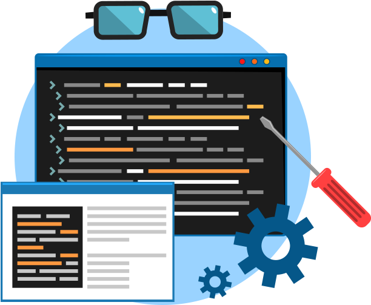

<!--
**MoglesonLima/moglesonlima** is a ✨ _special_ ✨ repository because its `README.md` (this file) appears on your GitHub profile.

Here are some ideas to get you started:

- 🔭 I’m currently working on ...
- 🌱 I’m currently learning ...
- 👯 I’m looking to collaborate on ...
- 🤔 I’m looking for help with ...
- 💬 Ask me about ...
- 📫 How to reach me: ...
- 😄 Pronouns: ...
- ⚡ Fun fact: ...
-->

<head>
  <link rel="stylesheet" type="text/css" href="./style/style.css">
</head>

<table >
<tr>
<td></td> 
<td> 
<h1>Hi 👋, I'm Mogleson Lima!</h1>
<ul hspace="30">
<li>🧑‍🎓 Graduated in Computer Networks from the Federal University of Ceará;</li>
<li> 👨‍💻 Studying Front/Back-End technologies;</li>
<li> 💭 Passionate about DevOps culture.</li>
<h3 align="left">  </h3>

</ul>            
</td>

</tr>
</table >

<h2>🛠 &nbsp;Tech Stack</h2>

<table >
<td>

</td>

<td> ━ </td>

<td>

</td>

<td> ━ </td>

<td>

</td>

<td> ━ </td>

<td>

</td>
</table>

<h2 >Connect with me: ⤵ </h2>

<table >
<td>

</td>
<td>

    

</td>
<td>
<a href="https://discord.com/channels/@me/832364479466963005" target="_blank">

</td>
</table>        

<h2>Ask me about: 💬</h2>

<table >
<td>
                
</td>
<td>

</td>
</table> 

